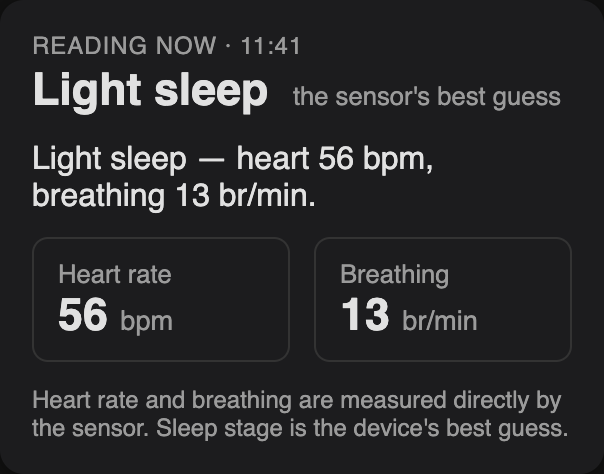
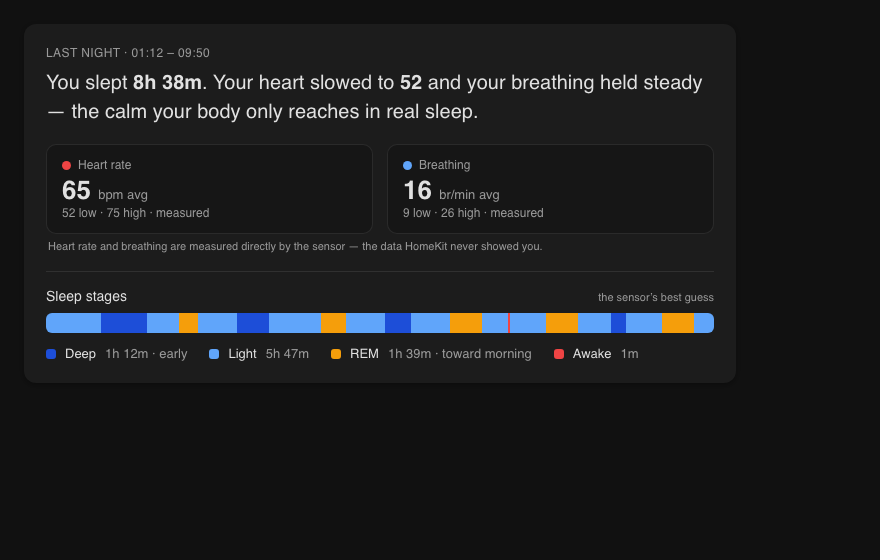

<p align="center">
  
</p>

# SleepRadar

[](https://github.com/florianhorner/ha-fp2-sleep/actions/workflows/ci.yml)

Contact-free sleep vitals (heart rate, breathing, and stages) from an Aqara FP2
in Home Assistant. No wearable, no Docker bridge, no developer account.

This is a small Home Assistant add-on for people who use an Aqara FP2 in
Sleep Monitor mode and want the sleep data that the local HomeKit or Matter
integration does not expose.

## What It Looks Like

**Now, live — the SleepRadar card, installed as-is:**



This is the SleepRadar Card (`card/sleepradar-card.js`). It ships with the
repo, reads three of the five sensors below (sleep stage, heart rate,
breathing), and needs no other cards or plugins. See
[The SleepRadar Card](#the-sleepradar-card) to install it.

**Last night — a preview of what's coming:**



This is a mockup of a planned future SleepRadar Card release, not something
you can build today. `examples/dashboard-sleep.yaml` (Mushroom cards,
ApexCharts Card) gets you a live "Now" card plus a raw 12-hour sleep-state
chart from the same sensors — it does not compute a session duration,
averaged vitals, or the segmented stage timeline shown above. That
sessionization is the next SleepRadar Card release.

Heart rate and breathing are **measured** directly by the sensor. Sleep stages
are the device's **best guess**, shown honestly as such. The point is not a
prettier chart. It is that this data was hidden from Home Assistant entirely,
and now it is five entities you can see, automate, and build on.

It creates five MQTT sensors in Home Assistant:

| Sensor | What it shows | Kind |
| --- | --- | --- |
| `sensor.aqara_fp2_sleep_heart_rate` | Heart rate in bpm | measured |
| `sensor.aqara_fp2_sleep_respiration_rate` | Respiration rate in breaths per minute | measured |
| `sensor.aqara_fp2_sleep_sleep_state` | Sleep stage (raw Aqara code) | best guess |
| `sensor.aqara_fp2_sleep_body_movement` | Body movement value | measured |
| `sensor.aqara_fp2_sleep_illuminance` | Illuminance in lux | measured |

The short version: install the add-on, enter your Aqara Home app account and
your FP2 device id, start it, then check that the five sensors appear.

## Before You Start

You need:

- Home Assistant OS or Home Assistant Supervised.
- The Mosquitto broker add-on, or another MQTT broker exposed to add-ons.
- An Aqara FP2 in Sleep Monitor mode.
- Your Aqara Home app account. This is not the Aqara store login.
- The FP2 `subject_id` from the Aqara app.

This add-on talks to the Aqara Home app cloud API. It does not need a separate
PC, Java service, Node-RED flow, or RocketMQ bridge.

**API note:** this uses Aqara's private, unofficial Home app API, not a
documented public one. Aqara can change or restrict it without notice. If
that happens, the sensors stop updating — history already recorded in Home
Assistant stays yours.

## Install

[](https://my.home-assistant.io/redirect/supervisor_add_addon_repository/?repository_url=https%3A%2F%2Fgithub.com%2Fflorianhorner%2Fha-fp2-sleep)

If the button opens My Home Assistant and asks for your Home Assistant URL,
enter it there once, or skip the button and use the manual repository URL
below. The manual path works the same way.

Or add it by hand:

1. In Home Assistant, open **Settings > Apps > App store**. (Home Assistant
   renamed Add-ons to Apps in the 2026.6 release; older guides and
   screenshots may still say "Add-ons" or "Add-on Store.")
2. Open the three-dot menu and choose **Repositories**.
3. Add this repository URL:

   ```text
   https://github.com/florianhorner/ha-fp2-sleep
   ```

4. Install **SleepRadar**.
5. Open the **Configuration** tab and set:

   ```yaml
   aqara_username: "your Aqara Home app email"
   aqara_password: "your Aqara Home app password"
   aqara_area: "EU"
   subject_id: "your FP2 subject_id"
   poll_interval: 60
   log_level: info
   device_name: "Aqara FP2 Sleep Monitor"
   mqtt_node_id: "aqara_fp2_sleep"
   ```

   `aqara_area` must match your Aqara account's region: `CN`, `EU`, `USA`,
   `RU`, or `KR`. `EU` (the default) uses the Germany endpoint.

6. Start the add-on.
7. Open the log. A working setup shows:

   ```text
   Aqara login OK
   Published discovery for 5 sensors
   ```

8. In Home Assistant, check **Developer Tools > States** for the five
   `sensor.aqara_fp2_sleep_*` sensors.

The first useful success moment is simple: the sensors exist, and
`sensor.aqara_fp2_sleep_sleep_state` changes when the FP2 reports a bed or
sleep state.

## Find Your `subject_id`

In the Aqara Home app, open the sleep FP2, then look under device information.
The value is the device identifier used by Aqara for that FP2.

Treat it as private. It is not a password, but it identifies your device.
When asking for help, redact it like this:

```text
lumi1.xxxxxxxxxxxx
```

Do not paste a full Supervisor options dump into an issue.

## The SleepRadar Card

Once the five sensors exist, install the card to see the "Now, live" view
from the screenshot above. It is one file, has no dependencies, and needs no
other Lovelace plugins.

1. Download `card/sleepradar-card.js` from this repository.
2. Copy it into your Home Assistant config's `www` folder, so it ends up at
   `/config/www/sleepradar-card.js`.
3. In Home Assistant, open **Settings > Dashboards**, then the three-dot menu
   and choose **Resources**.
4. Add a resource:

   ```text
   URL: /local/sleepradar-card.js
   Resource type: JavaScript module
   ```

5. Edit a dashboard, add a card, and choose **Manual**. Use:

   ```yaml
   type: custom:sleepradar-card
   ```

That's it — the card defaults to the add-on's default entities
(`sensor.aqara_fp2_sleep_*`). If you changed `mqtt_node_id`, set it on the
card too:

```yaml
type: custom:sleepradar-card
mqtt_node_id: your_custom_node_id
```

Or override individual entities:

```yaml
type: custom:sleepradar-card
entities:
  sleep_state: sensor.your_sleep_state_entity
  heart_rate: sensor.your_heart_rate_entity
  respiration_rate: sensor.your_respiration_rate_entity
```

The card behaves like a Home Assistant status card: current state first,
freshness second, and vitals only when they are live enough to trust. It shows
"no data yet" honestly if the sleep state sensor is missing or unavailable, a
"not measuring" state when the bed is empty, and a "stale" badge if the sleep
state is older than three poll intervals. When the bed is empty or the status
is stale, the card hides retained heart-rate and breathing values instead of
presenting the FP2's last in-bed numbers as live readings.

The stale threshold assumes the add-on's default `poll_interval: 60`. If you
changed `poll_interval` in the add-on's configuration, set the same value on
the card so the "stale" badge stays accurate:

```yaml
type: custom:sleepradar-card
poll_interval_seconds: 120
```

## Optional Templates And Dashboard

The add-on publishes raw data. The `examples/` folder contains optional Home
Assistant YAML for nicer names and a simple sleep dashboard.

- `examples/sleep_tracking.yaml` maps the raw sleep state into a readable
  phase sensor. Pre-wired to the add-on's default entities; load it as-is.
- `examples/dashboard-sleep.yaml` is an optional Lovelace view. It uses
  Mushroom cards, ApexCharts Card, and card-mod. Load `sleep_tracking.yaml`
  first; the view reads the phase sensor it creates.
- `examples/recorder.yaml` shows one way to keep the sleep sensors in
  Recorder. Pre-wired; load it as-is.
- `examples/automations.yaml` shows example automations that act on the data.
  These need your own light, vacuum, and thermostat entity IDs.

If you kept the default `mqtt_node_id`, the only `PLACEHOLDER_*` values left
to fill in are your own devices: the automations' light/vacuum/thermostat and
the dashboard's optional bed-status cross-check card (delete that card if you
have no separate bed sensor). If you changed `mqtt_node_id`, also update the
`sensor.aqara_fp2_sleep_*` references to match your node id.

## What You Can Build

Because these are normal Home Assistant entities, you can automate on them using
raw, measured data instead of a statistical guess about whether someone is
asleep. A few starting points (see `examples/automations.yaml`):

- Do not run lights at full brightness while someone is asleep.
- Hold off the robot vacuum until the room is empty or awake.
- Nudge the thermostat down during deep sleep.

This is the part the local integration cannot give you: the bedroom reacting to
what the sensor actually reads.

## Sleep State Codes

The raw `sleep_state` value is exposed as-is. The optional template maps it like
this:

| Code | Meaning |
| --- | --- |
| `0` | Out of bed |
| `1`, `2` | Awake |
| `3` | REM |
| `4` | Light sleep |
| `5` | Deep sleep |

Aqara reports two near-identical "awake" codes (`1` and `2`). The template shows
both as **Awake** to keep it plain: you are either awake, or in one of the three
sleep stages. The raw code stays available as an attribute if you want it.

Heart rate and breathing are measured directly and are the reliable part. Sleep
**stage** scoring is the device's best guess. In my own testing across multiple
nights it matched expected sleep architecture (deep sleep front-loaded, REM toward
morning), but some Aqara FP2 users report the device marking someone awake while
asleep. Treat the stages as indicative, the vitals as measured, and cross-check if
it matters to you.

## Troubleshooting

### Login Fails

Use the Aqara Home app account, not the Aqara store account. The store account
used for buying hardware is separate from the app account used by devices.

Also check `aqara_area`. Accounts are region-bound. `EU` uses the Germany
endpoint and is the default.

### Sensors Do Not Appear

Check:

- MQTT broker add-on is installed and running.
- The add-on log says `Published discovery for 5 sensors`.
- MQTT discovery is enabled in Home Assistant.
- `mqtt_node_id` is still `aqara_fp2_sleep`, unless you intentionally changed it.

If the MQTT broker add-on is still starting up (common right after a fresh
install, when both add-ons boot together), the log will show `MQTT connect
... failed ... retrying in Ns` a few times — this is expected and resolves
itself once the broker is up, for up to about 2 minutes. If it still fails
after that, restart the add-on once the broker add-on shows as running.

### Values Stay Unknown

Check:

- The FP2 is in Sleep Monitor mode.
- `subject_id` points to the sleep FP2, not another Aqara device.
- The Aqara Home app still shows current sleep data for that FP2.

### The Card Shows "No Data Yet"

Check:

- `card/sleepradar-card.js` is registered as a Lovelace resource (see
  [The SleepRadar Card](#the-sleepradar-card)) and the browser cache was
  cleared or hard-refreshed after adding it.
- The five sensors already exist in **Developer Tools > States**.
- If you changed `mqtt_node_id`, the card's config was updated to match
  (`mqtt_node_id:` or `entities:` in the card's YAML).

Home Assistant pins an entity's id the first time it creates that entity, and
does not rename it later — not when you change `mqtt_node_id`, and not when
you upgrade the add-on. If you installed before v1.1.0, or your entities
already existed the first time you upgraded, your real entity ids may not
match the card's `sensor.aqara_fp2_sleep_*` defaults even today. Check
**Developer Tools > States** for the actual ids and set them explicitly with
the card's `entities:` option (see [The SleepRadar Card](#the-sleepradar-card))
rather than relying on `mqtt_node_id` alone.

## Security And Privacy

Your Aqara username and password stay in the add-on options managed by
Supervisor. They are not stored in YAML by this repository.

The `appid`, `appkey`, and RSA public key in the source are public constants
from the Aqara Home app. They are not user credentials.

This add-on uses a private Aqara app API. Aqara can change it. The add-on will
try to log in again when the app token expires, but it cannot promise that the
private API will keep working forever.

See `SECURITY.md` before opening an issue with logs.
