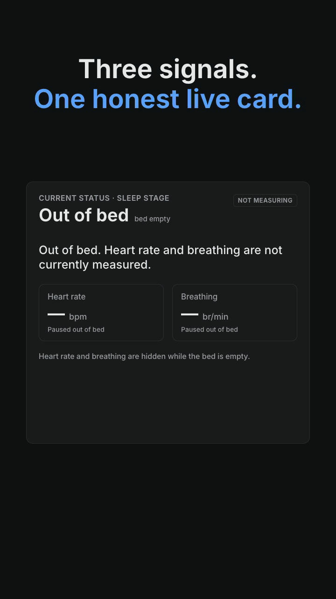
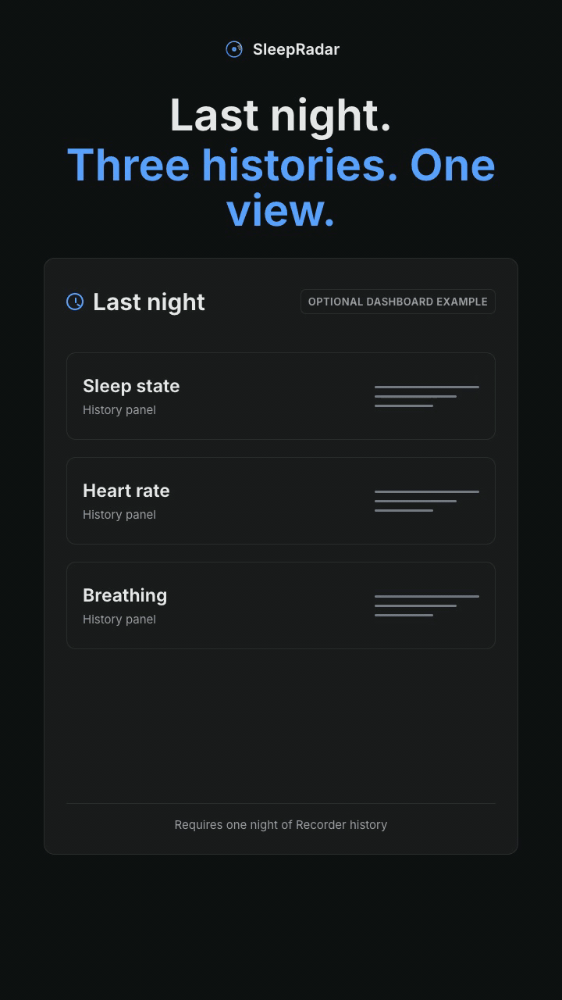
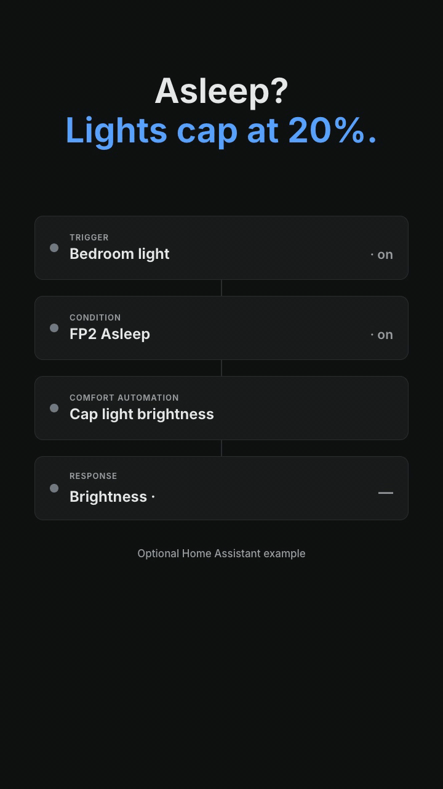
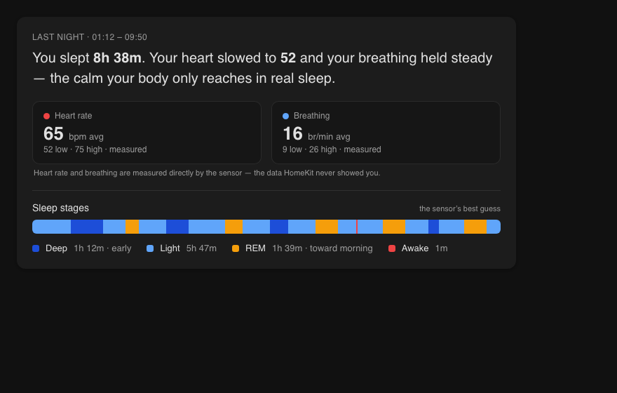

<p align="center">
  
</p>

# SleepRadar

[](https://github.com/florianhorner/ha-fp2-sleep/actions/workflows/ci.yml)

Contact-free sleep vitals (heart rate, breathing, and sleep stages) from an
Aqara FP2 in Home Assistant. No wearable, no Docker bridge, no developer
account.

> **Terminology.** "App" means the SleepRadar Home Assistant app. "Aqara Home
> app" means the Aqara mobile app. They are different things.

SleepRadar is a Home Assistant app for people who use an Aqara FP2 in Sleep
Monitor mode and want the sleep data that the local HomeKit or Matter
integration does not expose. It polls the Aqara Home app API and publishes
five MQTT entities you can see, automate, and build on.

> **Unofficial API.** SleepRadar uses Aqara's private, undocumented app API.
> Aqara can change or restrict it without notice. If that happens, the sensors
> stop updating. History already recorded in Home Assistant stays yours.

> **Fast triggers.** SleepRadar polls Aqara for vitals. If Matter or an Aqara
> push/RocketMQ integration gives you a faster FP2 sleep-state entity, use that
> for sleep/wake automations. Keep SleepRadar for heart rate, breathing, body
> movement, illuminance, and the bundled card.

## What It Looks Like

**Now, live — the SleepRadar card, installed as-is:**

<p align="center">
  
</p>

This is the SleepRadar Card (`card/sleepradar-card.js`). It ships with the
repo, reads three of the five sensors (sleep stage, heart rate, breathing),
and needs no other cards or plugins. See [The SleepRadar Card](#the-sleepradar-card).

Heart rate and breathing are **sensor-reported measurements**. Here,
"measured" identifies the kind of signal; it does not claim independent
validation or clinical accuracy. Sleep stages are the device's **best
estimate**, shown honestly as such. The point is not a prettier chart — it is
that this data was hidden from Home Assistant entirely, and now it is five
entities you can see, automate, and build on.

SleepRadar creates five MQTT sensors in Home Assistant:

| Sensor | What it shows | Kind |
| --- | --- | --- |
| `sensor.aqara_fp2_sleep_heart_rate` | Heart rate in bpm | Sensor-reported measurement |
| `sensor.aqara_fp2_sleep_respiration_rate` | Respiration rate in breaths/min | Sensor-reported measurement |
| `sensor.aqara_fp2_sleep_sleep_state` | Sleep stage (raw Aqara code) | Estimated |
| `sensor.aqara_fp2_sleep_body_movement` | Body movement value | Sensor-reported measurement |
| `sensor.aqara_fp2_sleep_illuminance` | Illuminance in lux | Sensor-reported measurement |

## Before You Start

You need:

- Home Assistant OS or Home Assistant Supervised.
- The Mosquitto broker app, or another MQTT broker accessible to apps.
- MQTT discovery enabled in Home Assistant.
- An Aqara FP2 in Sleep Monitor mode.
- Your Aqara Home app account credentials. This is the mobile app login, not
  the Aqara webshop account — they are separate.
- The FP2 `subject_id` from the Aqara Home app.

Tested with Home Assistant 2026.6. Older versions may still label this area as
Add-ons instead of Apps.

## Install

[](https://my.home-assistant.io/redirect/supervisor_add_addon_repository/?repository_url=https%3A%2F%2Fgithub.com%2Fflorianhorner%2Fha-fp2-sleep)

If the button opens My Home Assistant and asks for your Home Assistant URL,
enter it there once, or skip the button and use the manual repository URL
below. The manual path works the same way.

Or add it by hand:

1. In Home Assistant, open **Settings > Apps > Install app**.
2. Open the three-dot menu (top right), choose **Repositories**, then click
   **Add** (bottom right). This opens an **Add repository** box.
3. Paste this repository URL in the box, then click **Add**:

   ```text
   https://github.com/florianhorner/ha-fp2-sleep
   ```

4. Install **SleepRadar**.
5. Open the **Configuration** tab and fill in your details:

   ```yaml
   # Required
   aqara_username: "your-aqara-home-app-email"
   aqara_password: "your-aqara-home-app-password"
   subject_id: "lumi1.xxxxxxxxxxxx"
   # CN | EU | USA | RU | KR. This is the region your Aqara Home account was
   # created in, not where you live. An account does not exist outside its
   # region, so the wrong value rejects a correct password (see Login Fails).
   aqara_area: "EU"

   # Optional
   poll_interval: 60
   log_level: info
   device_name: "Aqara FP2 Sleep Monitor"
   mqtt_node_id: "aqara_fp2_sleep"
   ```

6. Start the app.
7. Open the log. A working setup shows:

   ```text
   Aqara login OK
   Published discovery for 5 sensors
   ```

8. Check for the five `sensor.aqara_fp2_sleep_*` sensors in [your entity
   states](https://my.home-assistant.io/redirect/developer_states/) (Developer
   Tools, then States).

First useful moment: `sensor.aqara_fp2_sleep_sleep_state` changes when the
FP2 reports a bed or sleep state.

## Find Your `subject_id`

In the Aqara Home app, open the sleep FP2, then open **Device Information**. It
looks like `lumi1.xxxxxxxxxxxx`. Treat it as private because it identifies your
device.

When asking for help, redact it:

```text
lumi1.xxxxxxxxxxxx
```

Do not paste a full app options dump into an issue.

## The SleepRadar Card

1. Download `card/sleepradar-card.js` from this repository.
2. Copy it to `/config/www/sleepradar-card.js`.
3. Open [your dashboard resources](https://my.home-assistant.io/redirect/lovelace_resources/)
   (Settings > Dashboards, three-dot menu, then **Resources**).
4. Add a resource:
   - URL: `/local/sleepradar-card.js`
   - Resource type: **JavaScript module**
5. Hard-refresh your browser (`Ctrl+Shift+R` / `Cmd+Shift+R`).
6. Add a card manually:

   ```yaml
   type: custom:sleepradar-card
   ```

The card defaults to the app's default entities. Override if you changed
`mqtt_node_id`:

```yaml
type: custom:sleepradar-card
mqtt_node_id: your_custom_node_id
```

Or override individual entities:

```yaml
type: custom:sleepradar-card
entities:
  sleep_state: sensor.your_sleep_state_entity
  heart_rate: sensor.your_heart_rate_entity
  respiration_rate: sensor.your_respiration_rate_entity
```

When the app reports a connection problem, the card shows that reason instead
of the generic "no data yet" message. It reads
`binary_sensor.<mqtt_node_id>_connection_problem` by default; override it the
same way if Home Assistant pinned a different id:

```yaml
type: custom:sleepradar-card
entities:
  connection_problem: binary_sensor.your_connection_problem_entity
```

If you changed `poll_interval`, set the same value on the card so the stale
badge stays accurate:

```yaml
type: custom:sleepradar-card
poll_interval_seconds: 120
```

Optionally gate the live card with an independent bed-occupancy entity:

```yaml
type: custom:sleepradar-card
bed_occupancy:
  entity: binary_sensor.bed_occupied
```

`bed_occupancy` must be a mapping, and its `entity` is required. For a
`binary_sensor.*`, you can omit `occupied_states`; it defaults to `["on"]`.
For every other entity, `occupied_states` must be a non-empty list of its exact
occupied state values. Quote `on`/`off` — unquoted, YAML reads them as booleans
and the card rejects them. The list may not contain `unknown`, `unavailable`,
`none`, or an empty string (those always mean uncertain occupancy), and it may
not contain both `on` and `off`, which would leave no state meaning the bed is
empty. The card rejects an invalid gate configuration instead of silently
ignoring it. It also rejects direct reuse of the configured sleep state,
heart-rate, or respiration entity as the occupancy source, including via the
`entities:` override block. Home Assistant template aliases cannot be detected
here, so the configured entity must still be independently sourced.

When the gate is closed, the card still reports the health of the sleep-state
feed: a missing or unavailable sleep-state entity shows a **no sensor data**
badge and a stale one shows **stale**, so a dead app does not look like an
ordinary empty bed.

With the gate enabled, confirmed occupancy is authoritative. Codes `3`–`5`
show the mapped stage and fresh sensor-reported vitals. Code `0` shows **In
bed**, the existing **not measuring** badge, and dashes; codes `1` and `2` show
**In bed — stage unknown** and may show fresh sensor-reported vitals. A
concrete non-occupied state overrides every Aqara code with **Out of bed**,
**not measuring**, and dashes. A missing entity, a non-string state, or an
`unknown`, `unavailable`, `none`, or empty value renders **Occupancy unknown**
and hides the vitals. Any other state that is simply not listed in
`occupied_states` — including device-specific ones like `offline` or
`calibrating` — is treated as not occupied and renders **Out of bed**; the card
does not claim the sensor reported an empty bed, only that it is not reporting
an occupied one. Either way this is fail-closed: occupancy that is not
positively confirmed never exposes retained values as live.

The gate trusts Home Assistant's current state and availability. It has no
occupancy-age timeout because stable binary sensors may legitimately remain
unchanged for a long time; it cannot detect a source that is silently stale
while still available. Omit `bed_occupancy` to preserve the legacy Aqara-only
labels: code `0` is **Out of bed**, while codes `1` and `2` are **Awake**.

The card shows "no data yet" if the sleep state sensor is missing, "not
measuring" when the bed is empty, and a "stale" badge if readings are older
than three poll intervals. In those states it hides retained heart-rate and
breathing values rather than showing stale in-bed numbers as live.

The occupancy gate changes only what the card displays. It does not change the
five MQTT entities, polling, Recorder data, or historical charts.

> **Entity ID note.** Home Assistant pins an entity ID on first creation and
> does not rename it later. If you installed before v1.1.0, your entity IDs
> may not match the `sensor.aqara_fp2_sleep_*` defaults. Check
> [your entity states](https://my.home-assistant.io/redirect/developer_states/)
> and use `entities:` to override if needed.

## Optional Templates and Dashboard

The `examples/` folder contains optional YAML:

- `examples/sleep_tracking.yaml` combines the raw sleep code with an
  independent `binary_sensor.bed_occupied`. It gives codes `3`–`5` indicative
  labels and keeps codes `0`–`2` from asserting occupancy or wakefulness. The
  dashboard's optional cross-check card uses it.
- `examples/recorder.yaml` keeps sleep sensors in Recorder. It has no
  dependencies.
- `examples/dashboard-sleep.yaml` is a Lovelace sleep dashboard. Register the
  SleepRadar Card first; the historical charts also require
  [ApexCharts Card](https://github.com/RomRider/apexcharts-card). Its optional
  cross-check card requires `sleep_tracking.yaml` and
  [Mushroom Cards](https://github.com/piitaya/lovelace-mushroom). Its live card
  has an enabled, fail-closed `bed_occupancy` gate using
  `binary_sensor.bed_occupied`; expose an independently sourced entity under
  that name before importing.
- `examples/automations.yaml` contains example automations. Replace
  `PLACEHOLDER_*` values with your own light, vacuum, and thermostat entity
  IDs, and load the occupancy-gated helpers from `sleep_tracking.yaml`.

<p align="center">
  
</p>

All files are pre-wired to the default `mqtt_node_id`. If you changed it,
update `sensor.aqara_fp2_sleep_*` references to match.

## What You Can Build

Because these are normal Home Assistant entities, you can automate on raw
sensor-reported data. A few starting points (see `examples/automations.yaml`):

<p align="center">
  
</p>

- Don't run lights at full brightness while someone is asleep.
- Hold off the robot vacuum until the room is empty or awake.
- Nudge the thermostat down during deep sleep.

## What's Next

**A preview of what's coming, not a current feature:**



Today, `examples/dashboard-sleep.yaml` gives you a live "Now" card plus a
"Last night" view that charts sleep stage, heart rate, and breathing over the
previous night as raw MQTT/Recorder history. The optional live occupancy gate
does not rewrite or filter that history. The example does not compute session
duration, averaged vitals, or the segmented stage timeline shown above. That
sessionization is the next planned SleepRadar Card release.

## Sleep State Codes

| Code | Legacy label without a gate | With confirmed occupancy |
| --- | --- | --- |
| `0` | Out of bed | In bed; not measuring |
| `1` | Awake | In bed — stage unknown |
| `2` | Awake | In bed — stage unknown |
| `3` | REM | REM |
| `4` | Light sleep | Light sleep |
| `5` | Deep sleep | Deep sleep |

**This mapping is community-derived and unverified.** At the 2026-07-31 truth
check, Aqara's public [resource documentation](https://opendoc.aqara.com/en/docs/developmanual/apiDocument/ResourceManagement.html)
explained how resource values and metadata are queried and directed detailed
resource lists to its developer console, but did not publish the FP2
`sleep_state` enumeration. A [community mapping reviewed by this
project](https://gist.github.com/Komzpa/396e66fb99592c14ba88e1bca21c11eb)
labels code `1` as *In Bed*, not *Awake*. Its labels for codes `3`/`4`/`5`
match the table above. Treat `0`, `1`, and `2` as "SleepRadar cannot determine
occupancy or wakefulness from this code alone," and read the raw code from the
attribute if you need to build your own logic.

The optional template (`examples/sleep_tracking.yaml`) implements the
gate-aware labels and keeps the raw code available as an attribute.

Heart rate and breathing are sensor-reported measurements, but the FP2 can
retain or report values when it incorrectly considers an empty bed occupied.
The optional `bed_occupancy` gate keeps those values out of the live card; the
raw entities and their history remain unchanged.

Sleep stage scoring is the device's best estimate, and it can be confidently
wrong. A [sanitized incident fixture](tests/fixtures/ghost-vitals-incident.json)
captures an approximately 2.5-hour window where an independent occupancy
sensor stayed empty while `sleep_state` reported codes `4`, `5`, and `3` across
300 update events. In the same window, `heart_rate` produced 301 update events:
27 consecutive value runs (26 transitions after the initial sample), 17
distinct values, and a 50–77 bpm range. The source uses `force_update`, so
Recorder can store repeated events even when the sensor-reported value does not
change. The fixture removes entity IDs and absolute timestamps. Nothing in the
add-on can infer true occupancy from those plausible-looking FP2 values alone.

So treat stages as indicative, and use `bed_occupancy` with an **independent**
occupancy signal (a bed sensor, a pressure mat, a separate presence zone) as
the authority for whether anyone is in bed. Do not derive occupancy from
`sleep_state` itself.

## Troubleshooting

### Login Fails

**The app still shows as `started` when the sign-in is permanently failing.**
The process is alive and retrying; only the sensors go unavailable. The
"started" badge is not proof that data is flowing. Read the
`binary_sensor.aqara_fp2_sleep_connection_problem` entity or the app log.

Use the Aqara Home app account (mobile app email), not the Aqara webshop
account. Check `aqara_area` first: an Aqara Home account only exists in the
region it was created in, so the wrong region rejects an otherwise correct
password.

**`code=106`, "Request failed. Please try again."** This is Aqara's text for a
rejected sign-in, and retrying does not help. It is what a wrong `aqara_area`
looks like. Set the region to match the account, then restart the app. If the
region was already correct, check `aqara_username` and `aqara_password` next.

The app log names the cause and the option to change, at `error` level. It keeps
retrying with a growing delay between attempts, so a wrong password is not
hammered against Aqara's login endpoint. The sensors stay unavailable until the
sign-in succeeds; fix the options and it recovers on its own.

If required fields are blank, SleepRadar logs the missing field and waits about
30 seconds before exiting. Fill in the options and start it again.

### Know When It Stops

SleepRadar publishes a diagnostic entity,
`binary_sensor.aqara_fp2_sleep_connection_problem` (or
`binary_sensor.<mqtt_node_id>_connection_problem` if you changed
`mqtt_node_id`). It turns **on** when data stops, and its `cause` attribute
carries the reason in plain language. It does not depend on the five vitals
sensors, so it stays readable while they are unavailable, and its state
survives a Home Assistant restart.

The app also raises a Home Assistant notification naming the cause and the fix,
updates it if the cause changes, and dismisses it once the connection recovers.

Two timing details:

- If the app is **updated from a version without Home Assistant API access**,
  approve that access once in the Configuration tab. Until then the diagnostic
  entity still works and the notification is skipped; the log says so.
- If the app **crashes** rather than failing to sign in, the diagnostic entity
  flips immediately but the five sensors stay on their last value for up to
  three poll intervals (about three minutes at the default) before Home
  Assistant expires them. The card shows the reported cause during that window
  instead of calling the feed stale.

Neither reaches your phone on its own. `examples/automations.yaml` has a
ready-made automation that forwards the cause to a notify service, with a
five-minute delay so a brief network blip does not wake you.

These outages happen overnight, and there is no backfill: a night SleepRadar
did not record stays missing.

### Sensors Do Not Appear

- Mosquitto broker app is installed and running.
- SleepRadar log shows `Published discovery for 5 sensors`.
- MQTT discovery is enabled in Home Assistant.
- `mqtt_node_id` is `aqara_fp2_sleep` unless you changed it.

> **MQTT startup race.** If SleepRadar and the broker start at the same time
> (for example, after a reboot), the log may show `MQTT connect failed —
> retrying` for up to about 2 minutes. This is expected. If it still fails
> after that, restart SleepRadar once the broker app shows as running. If you
> enable Home Assistant's Watchdog setting yourself, startup failure paths still
> slow-exit first so a permanent misconfiguration does not turn into a rapid
> restart loop.

### Values Stay Unknown

- The FP2 is in Sleep Monitor mode.
- `subject_id` points to the sleep FP2, not another Aqara device.
- The Aqara Home app still shows current sleep data for that FP2.

### The Card Shows "No Data Yet"

- `sleepradar-card.js` is registered as a resource (see
  [The SleepRadar Card](#the-sleepradar-card)) and the browser was
  hard-refreshed after adding it.
- The five sensors exist in
  [your entity states](https://my.home-assistant.io/redirect/developer_states/).
- If you changed `mqtt_node_id`, the card config reflects it.
- Check actual entity IDs. See the Entity ID note in
  [The SleepRadar Card](#the-sleepradar-card).

## Support

For normal problems,
[open the bug report form](https://github.com/florianhorner/ha-fp2-sleep/issues/new?template=bug_report.yml).
For vulnerabilities, read the [security policy](SECURITY.md) and
[report them privately](https://github.com/florianhorner/ha-fp2-sleep/security/advisories/new).

## Contributing

See [Contributing](CONTRIBUTING.md) for local setup and the pre-PR checks.
The [repository validation reference](docs/repository-validation.md) explains
gate ownership, CI and Conductor boundaries, and how to change a check safely.

## Security and Privacy

Your Aqara credentials are stored in Home Assistant app options only. They are
not stored in any YAML file in this repository.

The `appid`, `appkey`, and RSA public key in the source are public constants
from the Aqara Home app, not user credentials.

SleepRadar re-authenticates when the session token expires but cannot
guarantee the private API keeps working indefinitely.

Follow the [security policy](SECURITY.md) before sharing logs.
